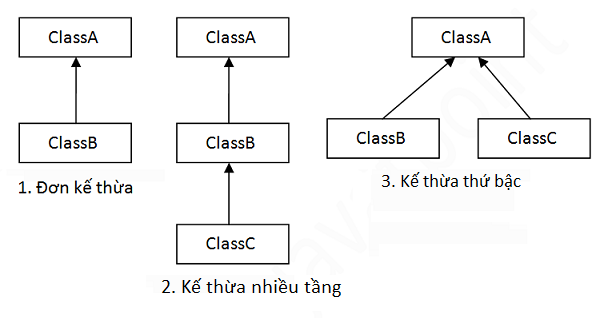
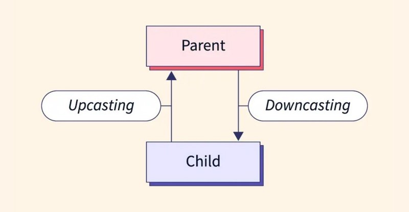

- [I. Tính đóng gói](#i-tính-đóng-gói)
- [II. Tính kế thừa](#ii-tính-kế-thừa)
  - [1. Khái quát chung](#1-khái-quát-chung)
  - [2. Các kiểu kế thừa](#2-các-kiểu-kế-thừa)
    - [a, Đơn kế thừa (Single inheritance)](#a-đơn-kế-thừa-single-inheritance)
    - [b, Kế thừa đa cấp (Multilevel inheritance)](#b-kế-thừa-đa-cấp-multilevel-inheritance)
    - [c, Kế thừa phân cấp (Hierarchical inheritance)](#c-kế-thừa-phân-cấp-hierarchical-inheritance)
    - [d, Đa kế thừa (Multiple Inheritance)](#d-đa-kế-thừa-multiple-inheritance)
  - [3. Interface](#3-interface)
    - [a, Định nghĩa Interface](#a-định-nghĩa-interface)
    - [b, Lớp triển khai Interface](#b-lớp-triển-khai-interface)
    - [c, Đa kế thừa qua Interface](#c-đa-kế-thừa-qua-interface)
    - [d, Kế thừa giữa các Interface](#d-kế-thừa-giữa-các-interface)
    - [e, Phương thức mặc định trong Interface (Java 8+)](#e-phương-thức-mặc-định-trong-interface-java-8)
    - [f, Phương thức tĩnh trong Interface (Java 8+)](#f-phương-thức-tĩnh-trong-interface-java-8)
- [III. Upcasting và Downcasting](#iii-upcasting-và-downcasting)
  - [1. Upcasting](#1-upcasting)
  - [2. Downcasting](#2-downcasting)
- [IV. Class Object](#iv-class-object)
- [V. Tính đa hình](#v-tính-đa-hình)
  - [1. Tính đa hình là gì?](#1-tính-đa-hình-là-gì)
  - [2. Tính đa hình trong Java là gì?](#2-tính-đa-hình-trong-java-là-gì)
  - [3. Phương thức để đạt tính đa hình trong Java](#3-phương-thức-để-đạt-tính-đa-hình-trong-java)
    - [a, Overriding (Ghi đè)](#a-overriding-ghi-đè)
    - [b, Overloading (Ghi chồng)](#b-overloading-ghi-chồng)
  - [4. Phân loại đa hình trong Java](#4-phân-loại-đa-hình-trong-java)
    - [a, Đa hình Compile -Time trong Java](#a-đa-hình-compile--time-trong-java)
    - [b, Đa hình Runtime trong Java](#b-đa-hình-runtime-trong-java)
  - [5. Đa hình Runtime trong Java với kế thừa đa tầng](#5-đa-hình-runtime-trong-java-với-kế-thừa-đa-tầng)
  - [6. Tại sao sử dụng tính đa hình trong Java?](#6-tại-sao-sử-dụng-tính-đa-hình-trong-java)


# I. Tính đóng gói
- **Khái niệm:** **Tính đóng gói (Encapsulation)** là một trong những nguyên tắc quan trọng trong Lập Trình Hướng Đối Tượng (OOP). Nguyên tắc này đề cập đến việc che giấu thông tin và hành vi bên trong đối tượng, chỉ tiết lộ những gì cần thiết và quy định cách truy cập thông qua các phương thức công khai.
<br>
- **Tầm quan trọng:** Trong lập trình, tính đóng gói giúp bảo vệ dữ liệu và tránh truy cập trực tiếp đến các thuộc tính của đối tượng từ bên ngoài. Điều này có ích trong việc quản lý và bảo vệ dữ liệu, đồng thời cho phép kiểm soát cách các thành phần khác nhau tương tác với đối tượng đó.
<br>
- **Cách triển khai:**<br>-&ensp;&ensp;Khai báo thuộc tính là `private`: Điều này giúp ngăn chặn việc truy cập trực tiếp từ bên ngoài.<br>-&ensp;&ensp;Sử dụng các phương thức `getter` và `setter`: Cho phép truy cập gián tiếp đến các thuộc tính thông qua các phương thức công khai này. Getter dùng để lấy giá trị, còn setter dùng để thay đổi giá trị của thuộc tính.

# II. Tính kế thừa
## 1. Khái quát chung
- **Khái niệm:** **Tính kế thừa (Inheritance)** là một trong những khía cạnh quan trọng nhất của Lập Trình Hướng Đối Tượng (OOP). Nó cho phép bạn tạo ra các lớp mới bằng cách sử dụng thông tin và hành vi từ các lớp đã tồn tại.
<br>
- **Ưu điểm:**<br>**-**&ensp;&ensp;**Tái sử dụng code:** Tính kế thừa cho phép bạn sử dụng lại mã nguồn đã tồn tại trong các lớp cha, giúp giảm lặp lại mã và tiết kiệm thời gian lập trình.<br>**-**&ensp;&ensp;**Dễ bảo trì:** Kế thừa giúp tách biệt các tính năng khác nhau của một chương trình thành các lớp khác nhau, giúp cho việc bảo trì và phát triển chương trình dễ dàng hơn.<br>**-**&ensp;&ensp;**Mở rộng tính năng:** Bạn có thể thêm các phương thức và thuộc tính mới vào lớp con mà không làm ảnh hưởng đến lớp cha, giúp bạn mở rộng tính năng của ứng dụng một cách dễ dàng.<br>**-**&ensp;&ensp;**Tăng tính linh hoạt:** Kế thừa giúp tăng tính linh hoạt của chương trình, cho phép thay đổi hoặc bổ sung các tính năng của chương trình một cách dễ dàng hơn.
<br>
- **Nhược điểm:**<br>-&ensp;&ensp;Nếu không được thiết kế đúng cách, kế thừa có thể dẫn đến mối quan hệ phức tạp giữa các lớp và tăng độ phức tạp của mã.<br>-&ensp;&ensp;Kế thừa có thể dẫn đến việc đồng bộ hóa các lớp con với các lớp cha, khiến cho việc thay đổi một lớp có thể dẫn đến các thay đổi phức tạp trong các lớp con.<br>&ensp;&ensp;Kế thừa cũng có thể dẫn đến việc tạo ra các lớp con không cần thiết, khiến cho chương trình trở nên khó hiểu và khó bảo trì.<br>**-**&ensp;&ensp;Kế thừa cũng có thể giới hạn tính đa hình của chương trình, khiến cho chương trình trở nên khó mở rộng và khó bảo trì.
<br>
- Khi nào cần sử dụng ***Tính kế thừa?***<br>-&ensp;&ensp;Khi có một số lớp có các thuộc tính và phương thức chung bằng cách tạo ra một lớp cha chung và kế thừa từ lớp đó để tránh lặp lại mã.<br>-&ensp;&ensp;Khi cần mở rộng các chức năng của một lớp hiện có bằng cách thêm các thuộc tính và phương thức mới.<br>-&ensp;&ensp;Khi cần ghi đè phương thức của lớp cha để đạt được hành vi khác nhau trong lớp con.<br>-&ensp;&ensp;Khi cần tạo ra một số lớp khác nhau với các thuộc tính và phương thức chung bằng cách tạo ra một lớp cha chung và kế thừa từ lớp đó để tạo ra các lớp con khác nhau.
<br>
- **Cách hoạt động:**<br>- Kế thừa trong java là sự liên quan giữa hai class với nhau, trong đó có **class cha (superclass)** và **class con (subclass)**. Khi kế thừa class con được hưởng tất cả các phương thức và thuộc tính của class cha. Tuy nhiên, nó chỉ được truy cập các thành viên `public` và `protected` của class cha. Nó không được phép truy cập đến thành viên `private` của class cha.<br>- Tư tưởng của kế thừa trong java là có thể tạo ra một class mới được xây dựng trên **các lớp đang tồn tại**. Khi kế thừa từ một lớp đang tồn tại bạn **có thể sử dụng lại** các phương thức và thuộc tính của lớp cha, đồng thời có thể **khai báo thêm** các phương thức và thuộc tính khác.
<br>
- **Cú pháp của kế thừa trong Java:**<br>- Sử dụng từ khóa `extends` để kế thừa.
```
class <Tên class con> extends <Tên class cha>{  
   <Thuộc tính và phương thức>
}  
```
## 2. Các kiểu kế thừa

### a, Đơn kế thừa (Single inheritance)
- Đơn kế thừa được sử dụng khi ta muốn tạo ra một lớp con duy nhất, kế thừa từ một lớp cha duy nhất. Điều này giúp cho mã nguồn dễ hiểu và dễ bảo trì hơn, bởi vì mối quan hệ giữa các lớp con và lớp cha là rõ ràng và dễ đoán.
- Tuy nhiên, đơn kế thừa cũng có nhược điểm, đó là ta không thể kế thừa các thuộc tính và phương thức của nhiều lớp cha khác nhau. Điều này có thể gây khó khăn trong việc tạo ra các lớp con phức tạp và đa dạng.
- Ví dụ:
```
class Animal {
    void eat() {
        System.out.println("eating...");
    }
}
 
class Dog extends Animal {
    void bark() {
        System.out.println("barking...");
    }
}
 
public class TestInheritance1 {
    public static void main(String args[]) {
        Dog d = new Dog();
        d.bark();
        d.eat();
    }
}
```
**Output:**
```
barking...
eating...
```
### b, Kế thừa đa cấp (Multilevel inheritance)
- Trong Java, kế thừa đa cấp (multilevel inheritance) được sử dụng khi ta cần tạo ra các lớp con phức tạp và đa dạng, các lớp con này có thể kế thừa các thuộc tính và phương thức từ nhiều lớp cha khác nhau.
- Kế thừa đa cấp cho phép ta tạo ra một hệ thống kế thừa theo dạng đường thẳng, trong đó, một lớp được kế thừa từ một lớp cơ sở và cũng có thể đóng vai trò là lớp cơ sở cho các lớp khác.
- Ví dụ:
```
class Animal {
    void eat() {
        System.out.println("eating...");
    }
}
 
class Dog extends Animal {
    void bark() {
        System.out.println("barking...");
    }
}
 
class BabyDog extends Dog {
    void weep() {
        System.out.println("weeping...");
    }
}
 
public class TestInheritance2 {
    public static void main(String args[]) {
        BabyDog d = new BabyDog();
        d.weep();
        d.bark();
        d.eat();
    }
}
```
**Output:**
```
weeping...
barking...
eating...
```
### c, Kế thừa phân cấp (Hierarchical inheritance)
- Trong kế thừa phân cấp, một lớp cha được kế thừa bởi nhiều lớp con khác nhau. Hệ thống kế thừa trong Hierarchical inheritance có dạng cây. So với kế thừa đa cấp, trong kế thừa phân cấp, một lớp con có thể kế thừa từ một lớp cha và cũng là lớp cha của một lớp con khác, tạo ra một cây kế thừa phức tạp hơn.
- Ta sử dụng kế thừa phân cấp khi muốn tạo ra một hệ thống lớp đối tượng có sự tương quan (hierarchy) theo kiểu “is-a” (là một…).
- Ví dụ:
```
class Animal {
    void eat() {
        System.out.println("eating...");
    }
}
 
class Dog extends Animal {
    void bark() {
        System.out.println("barking...");
    }
}
 
class Cat extends Animal {
    void meow() {
        System.out.println("meowing...");
    }
}
 
public class TestInheritance3 {
    public static void main(String args[]) {
        Cat c = new Cat();
        c.meow();
        c.eat();
        // c.bark(); // compile error
    }
}
```
**Output:**
```
meowing...
eating...
```
### d, Đa kế thừa (Multiple Inheritance)
- Đa kế thừa (multiple inheritance) trong Java là khả năng kế thừa các tính năng từ nhiều lớp cha khác nhau vào một lớp con. Tuy nhiên, Java không hỗ trợ đa kế thừa trực tiếp. Để đạt được đa kế thừa, ta phải thông qua các Interface trong Java.
- Ví dụ:
```
class A {
    void msg() {
        System.out.println("Hello");
    }
}
 
class B {
    void msg() {
        System.out.println("Welcome");
    }
}
 
public class C extends A,B { 
 public static void main(String args[]) {
        C obj = new C();
        obj.msg();
    }
}
```
**Output:**
```
Compile Time Error
```
- Lí do Java không hỗ trợ đa kế thừa với các lớp:<br>**-**&ensp;&ensp;**Tránh vấn đề mơ hồ (Diamond Problem):** Khi một lớp con kế thừa từ hai lớp cha có cùng một phương thức, Java sẽ không biết nên gọi phương thức của lớp cha nào. Điều này dẫn đến sự mơ hồ và khó kiểm soát.
Ví dụ, nếu cả lớp A và B đều có phương thức display() và lớp C kế thừa từ cả hai lớp này, thì khi gọi display() từ C, Java sẽ không biết lấy display() của lớp nào.<br>**-**&ensp;&ensp;**Đơn giản hóa thiết kế và giảm độ phức tạp:** Java được thiết kế để đơn giản và dễ sử dụng, tránh các khía cạnh phức tạp của C++ như đa kế thừa. Bằng cách loại bỏ đa kế thừa, Java giảm thiểu sự phức tạp trong việc phát triển và bảo trì mã.<br>**-**&ensp;&ensp;**Dễ bảo trì và quản lý mã nguồn:** Việc sử dụng đa kế thừa có thể gây khó khăn trong việc quản lý mã, vì khi có nhiều lớp cha, mỗi lớp có thể chứa những phương thức khác nhau, dẫn đến sự phụ thuộc phức tạp. Điều này có thể gây ra khó khăn khi bảo trì và mở rộng mã nguồn.
- Cách khắc phục vấn đề: Java sử dụng đa kế thừa thông qua các Interface.

## 3. Interface
- Trong Java, kế thừa qua interface là một cách hiệu quả để đạt được tính đa hình và đa kế thừa hành vi (behavior) mà không gây ra các vấn đề liên quan đến đa kế thừa như trong các ngôn ngữ khác. Một interface định nghĩa một tập hợp các phương thức mà một lớp phải thực hiện nếu lớp đó "implement" (triển khai) interface đó.
> Đa kế thừa không được hỗ trợ thông qua lớp trong Java nhưng là có thể bởi Interface vì: Đa kế thừa không được hỗ trợ thông qua lớp. Nhưng nó được hỗ trợ bởi Interface bởi vì không có tính lưỡng nghĩa khi trình triển khai được cung cấp bởi lớp Implementation. 
```
Ví dụ:
interface Printable{  
    void print();  
}  
interface Showable{  
    void print();  
}  
   
class TestTnterface1 implements Printable,Showable{  
    public void print() {
        System.out.println("Hello");
    }  
     
    public static void main(String args[]) {  
        TestTnterface1 obj = new TestTnterface1();  
        obj.print();  
    }  
}  
```
>Trong ví dụ trên, Printable và Showable interface có cùng các phương thức nhưng trình triển khai của nó được cung cấp bởi lớp TestInterface1, vì thế không có tính lưỡng nghĩa ở đây.
### a, Định nghĩa Interface
- Một interface trong Java chứa các phương thức không có phần thân, chỉ định các hành vi mà lớp triển khai cần phải thực hiện. Bạn khai báo một interface với từ khóa interface. Từ Java 8, interface có thể chứa các phương thức mặc định (default methods) và các phương thức tĩnh (static methods).
- Ví dụ:
```
interface Animal {
    void sound();   // phương thức trừu tượng (abstract method)
    default void sleep() {
        System.out.println("Sleeping...");
    }
}
```
### b, Lớp triển khai Interface
- Khi một lớp muốn kế thừa các phương thức từ một interface, lớp đó cần sử dụng từ khóa implements. Lớp này phải thực hiện tất cả các phương thức trừu tượng (abstract) có trong interface. Nếu không, lớp đó phải được khai báo là abstract.
- Ví dụ:
```
class Dog implements Animal {
    public void sound() {
        System.out.println("Dog barks");
    }
}

class Cat implements Animal {
    public void sound() {
        System.out.println("Cat meows");
    }
}
```
### c, Đa kế thừa qua Interface
- Java không cho phép một lớp kế thừa từ nhiều lớp cha, nhưng cho phép một lớp `implement` nhiều interface. Điều này giúp đạt được đa kế thừa hành vi một cách an toàn.
- Ví dụ:
```
interface Pet {
    void play();
}

class Dog implements Animal, Pet {
    public void sound() {
        System.out.println("Dog barks");
    }

    public void play() {
        System.out.println("Dog plays fetch");
    }
}
```
Trong ví dụ trên, lớp Dog triển khai cả Animal và Pet, do đó nó phải thực hiện tất cả các phương thức có trong hai interface này.

### d, Kế thừa giữa các Interface
- Interface cũng có thể kế thừa từ một hoặc nhiều interface khác, tạo nên một chuỗi kế thừa cho các interface. Trong trường hợp này, interface con sẽ có tất cả các phương thức của interface cha.
- Ví dụ:
```
interface Mammal extends Animal {
    void feedMilk();
}

class Human implements Mammal {
    public void sound() {
        System.out.println("Human speaks");
    }

    public void feedMilk() {
        System.out.println("Human feeds milk to baby");
    }
}
```
Trong ví dụ trên, Mammal là một interface kế thừa từ Animal. Khi lớp Human triển khai Mammal, nó phải thực hiện cả phương thức sound() từ Animal và feedMilk() từ Mammal.

### e, Phương thức mặc định trong Interface (Java 8+)
- Java 8 giới thiệu các phương thức mặc định (default methods) trong interface, cho phép interface có thể cung cấp phần thân cho phương thức. Điều này hữu ích khi muốn thêm một phương thức mới vào interface mà không làm thay đổi các lớp hiện tại đã triển khai interface đó.
- Ví dụ:
```
interface Animal {
    void sound();

    default void sleep() {
        System.out.println("Sleeping...");
    }
}

class Dog implements Animal {
    public void sound() {
        System.out.println("Dog barks");
    }
}

public class Main {
    public static void main(String[] args) {
        Dog dog = new Dog();
        dog.sound();  // Output: Dog barks
        dog.sleep();  // Output: Sleeping...
    }
}
```
### f, Phương thức tĩnh trong Interface (Java 8+)
- Phương thức tĩnh (static methods) cũng được phép trong interface. Chúng chỉ có thể được gọi qua tên của interface chứ không qua các đối tượng của lớp triển khai.
- Ví dụ:
```
interface Animal {
    void sound();

    static void info() {
        System.out.println("This is an Animal interface");
    }
}

public class Main {
    public static void main(String[] args) {
        Animal.info();  // Output: This is an Animal interface
    }
}
```
# III. Upcasting và Downcasting

## 1. Upcasting
- Khi biến tham chiếu của lớp cha tham chiếu tới đối tượng của lớp con, thì đó là Upcasting.
- Ví dụ:
```
public class Upcasting {
    public static void main(String[] args) {
        Cat cat = new Cat();
        Animal animal1 = cat; // Chuyển kiểu không tường minh
        Animal animal2 = (Animal) cat; // Chuyển kiểu tường minh
        cat.eat();
        cat.meow();
        animal1.eat();
        animal2.eat();
        // animal2.meow(); // Không thể gọi phương thức meow()
    }
}
```
Kết quả thực thi chương trình trên:
```
eating...
meowing...
eating...
eating...
```
- Với nội dung hàm main như trên, tôi đã thực hiện upcasting khi gán đối tượng cat thuộc lớp Cat cho đối tượng animal1 và animal2 thuộc lớp Animal.
- Đối với upcasting, chúng ta hoàn toàn có thể sử dụng chuyển kiểu tường mình hoặc không tường minh, cả hai cách đều được chấp nhận.

> **Lưu ý:** Mọi phương thức của lớp Animal hoàn toàn có thể gọi qua 1 đối tượng thuộc lớp Cat do giữa Animal và Cat có quan hệ IS_A. Tuy nhiên, nếu thực hiện override bất kỳ phương thức nào của lớp Animal tại lớp Cat thì trong quá trình runtime hàm được gọi sẽ là hàm của lớp Cat .

- Quay trở lại ví dụ phía trên. Nếu trong lớp Cat, thực hiện override hàm eat như sau:
```
public class Cat extends Animal {
    @Override
    public void eat() {
        System.out.println("Eat meat");
    }
    public void meow() {
        System.out.println("meowing...");
    }
}
```
Kết quả thực thi lại chương trình trên như sau:
```
Eat meat
meowing...
Eat meat
Eat meat
```

## 2. Downcasting
- Khác với upcasting, Downcasting là dạng chuyển kiểu chuyển 1 đối tượng là một thể hiện của lớp cha xuống thành đối tượng là thể hiện của lớp con trong quan hệ kế thừa.
- Thông thường, khi thực hiện dòng mã nguồn: `Animal cat = new Cat();` ta hoàn toàn có thể gọi những phương thức đã được override của lớp Animal tại lớp Cat qua đối tượng animal. Tuy nhiên, vấn đề phát sinh khi ta muốn gọi mọi phương thức của lớp Cat thông qua việc ép kiểu đối tượng thuộc lớp Animal. Khi đó, ta sử dụng downcasting.
- Ví dụ:
```
public class Downcating {
    public static void main(String[] args) {
        Animal animal = new Cat();
        Cat cat = (Cat) animal; // downcasting
        cat.meow();
    }
}
```
Ta thấy, meow() là phương thức chỉ có ở lớp Cat. Tuy nhiên, thông qua downcasting ta hoàn toàn có thể gọi ra phương thức đó thông qua đối tượng cat mà không cần new Cat() bằng việc downcasting đối tượng animal có kiểu Animal mà không xảy ra vấn đề trong quá trình biên dịch (compile) và thực thi (runtime).

> **Lưu ý:** khi thực hiện downcasting có thể sẽ gặp lỗi ClassCastException nếu không thể thực hiện downcassting được. Để an toàn chúng ta nên kiểm tra một đối tượng có phải là thể hiện của một kiểu dữ liệu cụ thể không trước khi thực hiện downcasting. Xem thêm hướng dẫn ở bài viết Toán tử instanceof trong java.

# IV. Class Object

- Sử dụng lớp Object là hữu ích nếu bạn muốn tham chiếu bất kỳ đối tượng nào mà bạn chưa biết kiểu dữ liệu của đối tượng đó. Chú ý rằng biến tham chiếu của lớp cha có thể tham chiếu đến đối tượng của lớp con được gọi là upcasting.
<br>
- Ví dụ: giả sử phương thức getObject() trả về một đối tượng nhưng nó có thể là bất kỳ kiểu nào như Employee,Student, ... chúng ta có thể sử dụng biến tham chiếu của lớp Object để tham chiếu tới đối tượng đó.
`Object obj=getObject(); // chúng ta không biết đối tượng gì được trả về từ phương thức này.`
<br>
- Lớp Object cung cấp một vài cách xử lý chung cho tất cả các đối tượng như đối tượng có thể được so sánh, đối tượng có thể được cloned, đối tượng có thể được notified...

**Cách khởi tạo lớp Object:**
- Khởi tạo trực tiếp một đối tượng từ lớp Object: Bạn có thể tạo một đối tượng của lớp Object bằng cách sử dụng từ khóa new như với các lớp khác:`Object obj = new Object();`.&ensp;&ensp;Đối tượng obj này không có thuộc tính hay phương thức riêng ngoài các phương thức chung của Object như toString(), hashCode(), và equals().
- Khởi tạo lớp Object thông qua các lớp con: Trong thực tế, khi bạn tạo một đối tượng từ bất kỳ lớp nào trong Java, đối tượng đó cũng là một instance của lớp Object. 
*Ví dụ:*
```
class Animal {
    // Các thuộc tính và phương thức của lớp Animal
}

Animal animal = new Animal();
```
Ở đây, animal thực chất cũng là một đối tượng của lớp Object. Bạn có thể sử dụng các phương thức của Object trên animal như animal.toString() hoặc animal.hashCode().

- Ép kiểu về Object
Khi một đối tượng của một lớp cụ thể được ép kiểu về Object, bạn chỉ có thể sử dụng các phương thức của Object trên đối tượng đó. Ví dụ:
```
String str = "Hello";
Object obj = (Object) str;
System.out.println(obj.toString());  // Sử dụng phương thức toString() của Object
```
Ép kiểu về Object thường được dùng trong các tình huống cần tính đa hình hoặc khi làm việc với các cấu trúc dữ liệu chung (generic data structures).

- Khởi tạo đối tượng Object qua Reflection
Bạn cũng có thể tạo ra một đối tượng của Object thông qua Reflection, mặc dù không phổ biến. Reflection thường được sử dụng khi cần tạo các đối tượng một cách linh hoạt, ví dụ như trong các framework.
```
try {
    Object obj = Object.class.getDeclaredConstructor().newInstance();
} catch (Exception e) {
    e.printStackTrace();
}
```
<br>
- Các phương thức của lớp Object:
Lớp Object cung cấp các phương thức như trong bảng sau:

| Phương thức  |  Mô tả |
|---|---|
`public final Class getClass()`|	Trả về đối tượng lớp Class của đối tượng hiện tại. Từ lớp Class đó có thể lấy được các thông tin metadata của class hiện tại.
`public int hashCode()`|	Trả về số hashcode cho đối tượng hiện tại.
`public boolean equals(Object obj)`	|So sánh đối tượng đã cho với đối tượng hiện tại.
`protected Object clone()`| throws CloneNotSupportedException	Tạo và trả về bản sao chép (clone) của đối tượng hiện tại.
`public String toString()`|	Trả về chuỗi ký tự đại diện của đối tượng hiện tại.
`public final void notify()`	|Đánh thức một luồng đang đợi trình giám sát của đối tượng hiện tại.
`public final void notifyAll()`|	Đánh thức tất cả các luồng đang đợi trình giám sát của đối tượng hiện tại.
`public final void wait(long timeout) throws InterruptedException`|	Làm cho Thread hiện tại đợi trong khoảng thời gian là số mili giây cụ thể, tới khi Thread khác thông báo (gọi phương thức notify() hoặc notifyAll()).
`public final void wait(long timeout, int nanos) throws InterruptedException`	|Làm cho Thread hiện tại đợi trong khoảng thời gian là số mili giây và nano giây cụ thể, tới khi Thread khác thông báo (gọi phương thức notify() hoặc notifyAll()).
`public final void wait() throws InterruptedException`|	Làm cho Thread hiện tại đợi tới khi Thread khác thông báo (gọi phương thức notify() hoặc notifyAll()).
`protected void finalize() throws Throwable`	|Được gọi bởi Garbage Collector trước khi đối tượng bị dọn rác.

# V. Tính đa hình
## 1. Tính đa hình là gì?
- Tính đa hình (polymorphism) xuất phát từ tiếng Hy Lạp, có nghĩa là “nhiều hình dạng” ý chỉ khả năng mà một đối tượng có thể nhận nhiều hình thức khác nhau.  Ví dụ thực tế, cùng là một chiếc điện thoại, nhưng có thể sử dụng để gọi điện, nhắn tin, chụp ảnh, nghe nhạc, v.v. Đây chính là biểu hiện của tính đa hình
- Trong lập trình, đa hình giúp một đối tượng có khả năng nhận nhiều dạng khác nhau.

## 2. Tính đa hình trong Java là gì?
- Trong Java, tính đa hình được thể hiện qua việc cho phép một biến tham chiếu có thể trỏ đến các đối tượng thuộc các lớp khác nhau, miễn là chúng kế thừa từ một lớp chung. Điều này giúp chúng ta có thể xây dựng các hệ thống phần mềm linh hoạt và dễ mở rộng hơn. Biến tham chiếu ở đây được sử dụng để lưu trữ địa chỉ bộ nhớ của đối tượng đó (tương tự như số nhà của bạn vậy) và mỗi biến tham chiếu sẽ tương ứng cho mỗi đối tượng
- Giả sử chúng ta có lớp NhanVien kế thừa từ lớp ConNguoi. Một biến tham chiếu có thể trỏ đến đối tượng thuộc lớp ConNguoi hoặc đối tượng thuộc lớp NhanVien, biến tham chiếu nv1, nv2,nv3,… Trong ngữ cảnh này, chúng ta có thể gọi phương thức thongTin của lớp ConNguoi hoặc lớp NhanVien thông qua biến tham chiếu đó.

## 3. Phương thức để đạt tính đa hình trong Java
Vậy làm sao để đạt tính đa hình trong Java? Chúng ta sẽ sử dụng 2 phương thức chính sau:
### a, Overriding (Ghi đè)
- Overriding là kỹ thuật cho phép lớp con định nghĩa lại phương thức của lớp cha với cùng tên, cùng tham số và cùng kiểu trả về. Khi gọi phương thức thông qua đối tượng của lớp con, phương thức của lớp con sẽ được thực thi thay vì phương thức của lớp cha.
- Nó giống như việc bạn được chỉ định để thực hiện nhiệm vụ đó bởi một người quản lý. Bạn nhận thấy có một cách để thực hiện công việc tốt hơn so với cách ban đầu. Bạn quyết định áp dụng cách của mình và thông báo cho người quản lý.
- Ví dụ:
```
class ConNguoi {
  void hienThi() {

    System.out.println(“Tôi là con người.”);

  }

}

class NhanVien extends ConNguoi {

  void hienThi() {

    System.out.println(“Tôi là nhân viên.”);

  }

}

public class Main {
  public static void main(String[] args) {
    ConNguoi conNguoi = new NhanVien();
    conNguoi.hienThi(); // In ra: “Tôi là nhân viên.”
  }

}
```
### b, Overloading (Ghi chồng)
- Overloading là kỹ thuật tạo ra nhiều phương thức cùng tên nhưng khác nhau về số lượng hoặc kiểu dữ liệu của tham số. Các phương thức được gọi tương ứng với các tham số truyền vào. Môt ví dụ thực tế để bạn dễ hiểu hơn là máy giặt có nhiều chế độ giặt khác nhau. Máy giặt sử dụng kỹ thuật nạp chồng (overloading) để cung cấp cho bạn nhiều tùy chọn khác nhau như giặt nhanh, giặt êm, giặt bằng nước nóng để giặt các loại quần áo khác nhau.
- Ví dụ:
```
class HinhChuNhat {
  double tinhDienTich(double chieuDai, double chieuRong) {
    return chieuDai * chieuRong;
  }
  double tinhDienTich(double canh) {
    return canh * canh;
  }

}
```
## 4. Phân loại đa hình trong Java
Đa hình trong Java được chia làm 2 loại chính là đa hình Compile time (thời điểm biên dịch) và đa hình runtime (thời điểm chạy). Với mỗi loại đa hình này sẽ có phương thức thực hiện khác nhau.
### a, Đa hình Compile -Time trong Java
- Đa hình compile time (thời điểm biên dịch) trong Java còn được gọi là đa hình tĩnh (static) vì nó quyết định về phương thức nào sẽ được gọi tại thời điểm biên dịch, dựa trên kiểu của biến tham chiếu được sử dụng để gọi phương thức. Điều này xảy ra khi chúng ta sử dụng các phương thức được định nghĩa ở lớp cha hoặc interface và triển khai lại chúng trong các lớp con. Đa hình biên dịch có thể được đạt được thông qua quá trình nạp chồng phương thức (Method Overloading).
- Ví dụ:

```
public class Example {
    public void display(int num) {
        System.out.println(“Number: ” + num);
    }
    public void display(String text) {
        System.out.println(“Text: ” + text);
    }   
    public void display(int num1, int num2) {
        System.out.println(“Numbers: ” + num1 + “, ” + num2);
    }
}
```
Ở ví dụ trên, chúng ta có ba phương thức display() có cùng tên nhưng có tham số khác nhau. Tại thời điểm biên dịch, Java sẽ xác định phương thức nào sẽ được gọi dựa trên thông tin về tham số truyền vào.
> Lưu ý: Ngoài method overloading, tính đa hình nói chung còn có thể đạt được bằng operator overloading. Tuy nhiên, Java không hỗ trợ operator overloading nên chúng ta sẽ không đi sâu về vấn đề này.

### b, Đa hình Runtime trong Java
- Đa hình Runtime (thời điểm chạy) hay đa hình động (dynamic) trong Java là việc gọi phương thức được được ghi đè trong thời gian chạy chương trình.  Điều này có nghĩa là JVM quyết định xem sử dụng cài đặt của phương thức nào dựa trên kiểu thực tế của đối tượng tại thời điểm chạy.xảy ra khi quyết định. Đa hình runtime đạt được thông qua việc ghi đè phương thức (overriding).
- Ở đây, ghi đè được xác định bằng cách sử dụng một biến tham chiếu của lớp cha. Phương thức sẽ được gọi dựa trên đối tượng xác định bởi biến tham chiếu. Điều này còn được gọi là upcasting ( quá trình chuyển đổi kiểu dữ liệu đối tượng từ lớp con sang lớp cha).
> Lưu ý: Đa hình Runtime chỉ có thể được đạt được thông qua phương thức ghi đè, không phải thông qua biến do biến tham chiếu đã được xác định tại Compile time và không thẻ thay đổi tại run-time.
- Ví dụ:
```
public class Animal {
    public void makeSound() {

        System.out.println(“Animal is making a sound”);

    }

}

public class Cat extends Animal {

    @Override

    public void makeSound() {

        System.out.println(“Meow!”);

    }

}

public class Dog extends Animal {

    @Override

    public void makeSound() {

        System.out.println(“Woof!”);

    }

}

public class Main {

    public static void main(String[] args) {

        Animal animal1 = new Cat();

        Animal animal2 = new Dog();

        animal1.makeSound(); // Output: “Meow!”

        animal2.makeSound(); // Output: “Woof!”

    }

}
```
Ở ví dụ trên, chúng ta tạo ra hai đối tượng animal1 và animal2 với kiểu dữ liệu là lớp cha Animal, nhưng thực sự được khởi tạo là đối tượng của lớp con Cat và Dog. Khi gọi phương thức makeSound() trên hai đối tượng này, phương thức được ghi đè trong lớp con sẽ được thực thi.

## 5. Đa hình Runtime trong Java với kế thừa đa tầng
- Kế thừa đa tầng là một tính năng trong Java cho phép một lớp con kế thừa từ một lớp cha, và lớp cha này lại kế thừa từ một lớp khác. Ví dụ, lớp con Dog kế thừa từ lớp cha Animal, và lớp cha Animal kế thừa từ lớp cha LivingBeing.
- Khi kết hợp đa hình runtime với kế thừa đa tầng, chúng ta có thể sử dụng tính đa hình để gọi phương thức của đối tượng đang được xác định bởi biến tham chiếu của lớp cha, đối tượng này có thể thuộc lớp con của lớp cha đó hoặc thuộc một lớp cha khác nằm trong chuỗi kế thừa đa tầng. Ví dụ:
```
class LivingBeing {
    public void eat() {

        System.out.println(“This living being is eating”);

    }

}

class Animal extends LivingBeing {

    @Override

    public void eat() {

        System.out.println(“This animal is eating”);

    }

}

class Dog extends Animal {

    @Override

    public void eat() {

        System.out.println(“This dog is eating”);

    }

}

public class Main {

    public static void main(String[] args) {

        LivingBeing lb1 = new LivingBeing();

        LivingBeing lb2 = new Animal();

        LivingBeing lb3 = new Dog();      

        lb1.eat(); // This living being is eating

        lb2.eat(); // This animal is eating

        lb3.eat(); // This dog is eating

    }

}
```
Khi gọi phương thức eat() thông qua biến tham chiếu lb1 của lớp cha LivingBeing, phương thức eat() của LivingBeing sẽ được gọi. Khi gọi phương thức eat() thông qua biến tham chiếu lb2 của lớp con Animal, phương thức eat() của Animal sẽ được gọi. Và khi gọi phương thức eat() thông qua biến tham chiếu lb3 của lớp con Dog, phương thức eat() của Dog sẽ được gọi.

## 6. Tại sao sử dụng tính đa hình trong Java?
- Đa hình (Polymorphism) trong Java cho phép viết một phương thức có thể xử lý chính xác nhiều loại chức năng khác nhau có cùng tên. Chúng ta cũng có thể đạt được tính nhất quán trong mã của mình bằng cách sử dụng đa hình.
- Ưu điểm của đa hình trong Java:<br>-&ensp;&ensp;Nó cung cấp khả năng tái sử dụng cho mã.Chúng ta có thể tận dụng các lớp và phương thức đã được định nghĩa trước để triển khai các chức năng mới mà không cần viết lại mã nguồn từ đầu. Ngoài ra, người lập trình có thể thay đổi mã mà không ảnh hưởng đến mã gốc.<br>-&ensp;&ensp;Cho phép tạo ra các lớp con có tính chất riêng của chúng và sử dụng chúng trong một cấu trúc kế thừa phức tạp hơn.<br>-&ensp;&ensp;Với ít dòng mã hơn, người lập trình dễ dàng hơn trong việc sửa lỗi mã.
- Nhược điểm của tính đa hình trong Java:<br>-&ensp;&ensp;Tính đa hình có thể làm tăng độ phức tạp của mã nguồn và khó hiểu hơn, đặc biệt là khi sử dụng nhiều lớp con kế thừa từ cùng một lớp cha.<br>-&ensp;&ensp;Tính đa hình có thể làm giảm hiệu suất của chương trình trong một số trường hợp. Khi chúng ta sử dụng đa hình, Java phải tìm kiếm phương thức thích hợp để thực thi, điều này có thể làm giảm hiệu suất.
>Tuy nhiên chúng ta vẫn có cải thiện nhược điểm của tính đa hình trong Java bằng việc sử dụng các các thiết kế mẫu (design patterns), áp dụng các kỹ thuật và các công cụ hỗ trợ khác như Kotlin, Scala hoặc IDE như Eclipse,…

