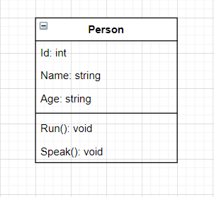
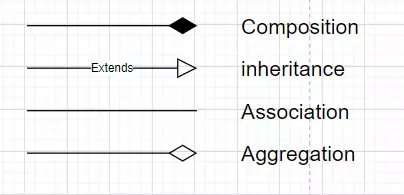
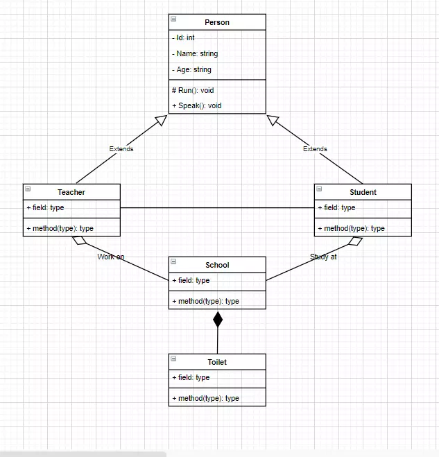
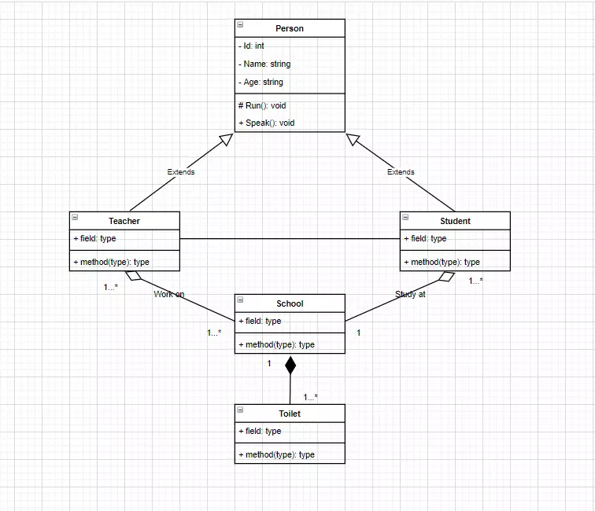
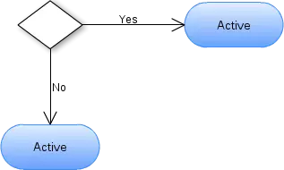
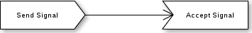
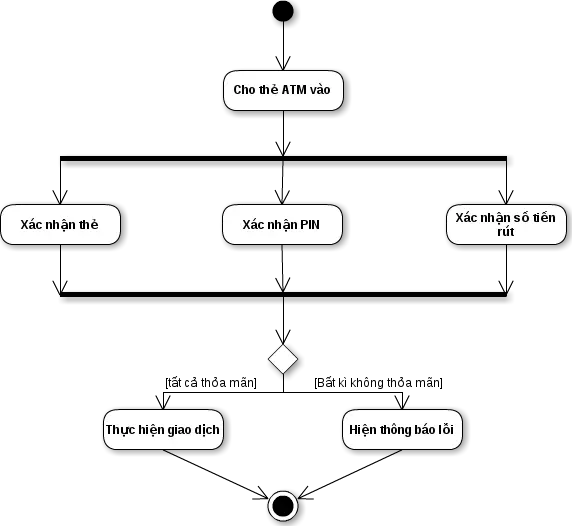
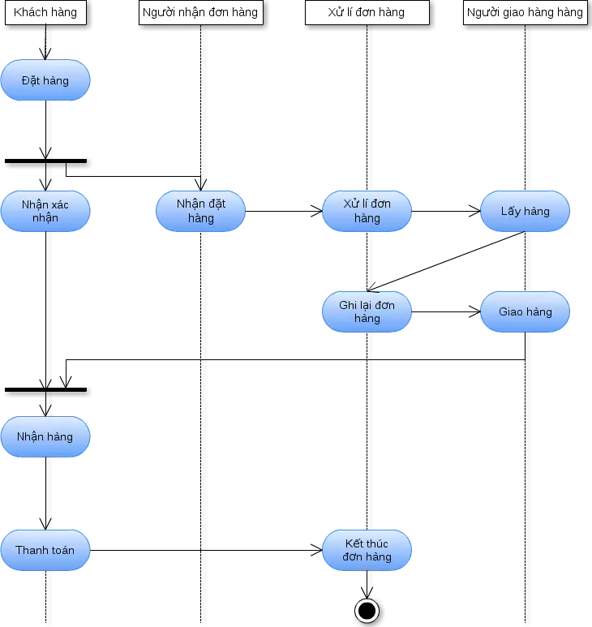

- [I. Version Control là gì? Tại sao cần dùng Version Control?](#i-version-control-là-gì-tại-sao-cần-dùng-version-control)
  - [1. Khái niệm](#1-khái-niệm)
  - [2. Lý do cần dùng Version Control](#2-lý-do-cần-dùng-version-control)
- [II. Các khái niệm về Git](#ii-các-khái-niệm-về-git)
  - [3. Khi nào cần Pull Request? Cách tạo Pull Request](#3-khi-nào-cần-pull-request-cách-tạo-pull-request)
    - [a, Khi nào cần Pull Request:](#a-khi-nào-cần-pull-request)
    - [b, Cách tạo Pull Request:](#b-cách-tạo-pull-request)
  - [4. Resolve conflict khi merge pull request](#4-resolve-conflict-khi-merge-pull-request)
- [III. UML là gì?](#iii-uml-là-gì)
  - [1. Khái niệm](#1-khái-niệm-1)
  - [2. Khái niệm về UML](#2-khái-niệm-về-uml)
  - [3. Mô hình Class Diagram](#3-mô-hình-class-diagram)
    - [a, Định nghĩa Class Diagram](#a-định-nghĩa-class-diagram)
    - [b, Các tính chất cơ bản của class diagram](#b-các-tính-chất-cơ-bản-của-class-diagram)
    - [c, Access Modifier trong class diagram](#c-access-modifier-trong-class-diagram)
    - [d, Relationship trong class diagram](#d-relationship-trong-class-diagram)
    - [e, Multiplicity trong class diagram](#e-multiplicity-trong-class-diagram)
  - [4. Mô hình Activity Diagram](#4-mô-hình-activity-diagram)
    - [a, Giới thiệu biểu đồ hoạt động](#a-giới-thiệu-biểu-đồ-hoạt-động)
    - [b,Các thành phần của biểu đồ hoạt động](#bcác-thành-phần-của-biểu-đồ-hoạt-động)
    - [c, Ví dụ](#c-ví-dụ)
  - [5. Lí do cần vẽ UML](#5-lí-do-cần-vẽ-uml)

# I. Version Control là gì? Tại sao cần dùng Version Control?
## 1. Khái niệm
- Version Control (hệ thống quản lý phiên bản) là một hệ thống giúp theo dõi các thay đổi của mã nguồn hoặc tài liệu theo thời gian. Các hệ thống quản lý phiên bản cho phép nhiều người làm việc trên cùng một dự án mà không lo bị mất mát hoặc xung đột dữ liệu.

## 2. Lý do cần dùng Version Control
- Quản lý lịch sử thay đổi: Giúp lưu lại tất cả các phiên bản của mã nguồn, có thể quay lại các phiên bản trước nếu gặp lỗi.
- Hỗ trợ làm việc nhóm: Nhiều lập trình viên có thể làm việc đồng thời trên cùng một dự án mà không gặp xung đột dữ liệu.
- Theo dõi sự thay đổi: Dễ dàng nhận biết ai đã thực hiện thay đổi gì, ở đâu, và khi nào.
- Phục hồi dữ liệu: Có khả năng khôi phục lại các phiên bản trước khi xảy ra lỗi.

# II. Các khái niệm về Git
- Git là một hệ thống quản lý phiên bản phân tán phổ biến hiện nay. Dưới đây là các khái niệm cơ bản trong Git:
- Repository (Repo): Là nơi lưu trữ mã nguồn và các thông tin về lịch sử thay đổi. Một repository có thể là cục bộ (local) hoặc trên máy chủ (remote).
- Branch: Nhánh là một phiên bản độc lập của mã nguồn. Mặc định Git sẽ tạo một nhánh tên là main hoặc master. Các nhánh khác được tạo ra để phát triển các tính năng mới mà không ảnh hưởng đến mã nguồn chính.
- Commit: Là một bản ghi về những thay đổi đã được thực hiện trên mã nguồn. Mỗi commit đều có một mã định danh duy nhất (SHA).
- Merge: Là quá trình gộp các thay đổi từ một nhánh khác vào nhánh hiện tại.
- Rebase: Là quá trình di chuyển hoặc kết hợp một nhánh với một nhánh khác theo cách thay đổi lại lịch sử commit.
- Gộp commit (Squash): Là việc kết hợp nhiều commit lại thành một commit duy nhất để giữ cho lịch sử commit gọn gàng.
- Pull: Là hành động lấy các thay đổi từ repository trên máy chủ (remote) về repository cục bộ (local).
- Push: Là hành động đưa các thay đổi từ repository cục bộ (local) lên repository trên máy chủ (remote).
- Clone: Là việc sao chép một repository từ máy chủ về máy cục bộ.
- Fork: Tạo một bản sao độc lập của một repository trên tài khoản cá nhân của người dùng.
- Pull Request: Là yêu cầu gộp mã từ một nhánh (branch) của một repository khác vào nhánh chính của repository gốc. Thường được sử dụng khi một lập trình viên muốn đóng góp mã vào dự án mà họ không sở hữu.
- Gitignore: Là tệp chứa danh sách các tệp hoặc thư mục mà người dùng muốn Git bỏ qua, không theo dõi sự thay đổi.

## 3. Khi nào cần Pull Request? Cách tạo Pull Request
### a, Khi nào cần Pull Request:
- **Khi làm việc theo nhóm:** Để chia sẻ thay đổi của bạn với các thành viên khác trong nhóm và để nhận được sự xem xét, kiểm tra hoặc phê duyệt từ đồng đội trước khi hợp nhất vào nhánh chính.
- **Dự án mã nguồn mở:** Nếu bạn muốn đóng góp cho một dự án mã nguồn mở, Pull Request là cách bạn đề xuất các thay đổi của mình để bảo trì viên dự án có thể xem xét.
- **Kiểm soát chất lượng:** Khi bạn muốn đảm bảo các thay đổi đã được kiểm tra và đánh giá (cả tự động lẫn thủ công) trước khi đưa vào sản phẩm chính thức.

### b, Cách tạo Pull Request:
- **Bước 1:** Clone repo về máy:
    ```bash
    git clone <URL-repository>
    ```
- **Bước 2:** Tạo 1 nhánh mới để làm việc trên đó:
    ```bash
    git checkout -b <branch-name>
    ```
- **Bước 3:** Commit và Push
  + Thêm các thay đổi trong mã nguồn vào danh sách commit:
    ```bash
    git add .
    ```
  + Commit các thay đổi:
    ```bash
    git commit -m "Mô tả"
    ```
  + Đẩy thay đổi lên repository:
    ```bash
    git push origin <branch-name>
    ```
- **Bước 4:** Tạo Pull Request trên Github:
  + Vào repository của bạn trên GitHub.
  + Chọn nhánh mới vừa push và nhấn nút `Compare & pull request` hoặc vào phần `Pull requests` và nhấn `New pull request`.
  + Đảm bảo nhánh gốc (base) là nhánh bạn muốn hợp nhất vào (ví dụ `main`) và nhánh đích (compare) là nhánh của bạn (ví dụ `ten-nhanh-moi`).
  + Thêm `tiêu đề` và `mô tả` cho Pull Request của bạn để giải thích về thay đổi.
  + Nhấn `Create pull request` để hoàn tất.   

## 4. Resolve conflict khi merge pull request
- **Xung đột** (conflict) trong quá trình `Merge Pull Request` có nghĩa là có các thay đổi **xung đột** nhau giữa **nhánh nguồn** và **nhánh đích** (thường là main). Xung đột thường xảy ra khi cùng một đoạn mã đã được chỉnh sửa theo các cách khác nhau trong hai nhánh.
- Xung đột xảy ra thường khi:
  + Hai người hoặc hai nhánh thay đổi cùng một phần của một file.
  + Một bên thay đổi hoặc xóa một file mà bên kia vẫn giữ nguyên hoặc chỉnh sửa.

**Quá trình giải quyết xung đột:**
`Khi xung đột xảy ra, GitHub sẽ hiển thị thông báo “This branch has conflicts that must be resolved” trên Pull Request. Bạn có thể chọn Resolve conflicts để xem chi tiết những phần bị xung đột.`

  + Bấm vào nút “Resolve conflicts” trên GitHub.
  + Chỉnh sửa thủ công các tệp bị xung đột. Các phần bị xung đột sẽ có dấu hiệu như sau:
    ```java
    <<<<<<< tên-nhánh
    Thay đổi trên nhánh của bạn
    =======
    Thay đổi trên nhánh chính
    >>>>>>> main
    ```
    + Giữ lại phần mã bạn muốn hoặc kết hợp cả hai, rồi xóa các ký hiệu `<<<<<<<`, `=======` và `>>>>>>>`.
  + Nhấn `Mark as resolved` sau khi sửa xong từng tệp.
  + Commit hợp nhất (merge commit) để hoàn tất.

# III. UML là gì?
## 1. Khái niệm
- UML (Unified Modeling Language) là một ngôn ngữ mô hình hóa thống nhất được sử dụng để trực quan hóa, thiết kế và tài liệu hóa các hệ thống phần mềm.

## 2. Khái niệm về UML
- UML giúp biểu diễn các thành phần và mối quan hệ của hệ thống thông qua các mô hình (diagram) khác nhau.
- UML bao gồm 14 loại mô hình khác nhau, chia thành 2 nhóm chính:<br>-&ensp;&ensp;Structural Diagrams (cấu trúc): Ví dụ như Class Diagram, Object Diagram, Component Diagram.<br>-&ensp;&ensp;Behavioral Diagrams (hành vi): Ví dụ như Activity Diagram, Use Case Diagram, Sequence Diagram.

## 3. Mô hình Class Diagram
### a, Định nghĩa Class Diagram
- Class diagram mô tả kiểu của các đối tượng trong hệ thống và các loại quan hệ khác nhau tồn tại giữa chúng.
- Là một kỹ thuật mô hình hóa tồn tại ở tất cả các phương pháp phát triển hướng đối tượng.
- Biểu đồ hay dùng nhất trong UML và gần gũi nhất với các lập trình viên.
- Giúp các lập trình viên trao đổi với nhau và hiểu rõ ý tưởng của nhau.

### b, Các tính chất cơ bản của class diagram
- Tên class
- Attribute (field, property)
- Operation (method, function)
Ví dụ khai báo tên, attribute, operation kèm theo kiểu trả về của 1 class:


### c, Access Modifier trong class diagram
- Sử dụng để đặc tả phạm vi truy cập cho các Attribute và Operation của 1 class (Cấp quyền cho các class khác sử dụng Attribute và Operation của class này).
- 4 lựa chọn phạm vi truy cập<br>-&ensp;&ensp;Private ( - ): Chỉnh mình các đối tượng được tạo từ class này có thể sử dụng.<br>-&ensp;&ensp;Public ( + ): Mọi đối tượng đều có thể sử dụng.<br>-&ensp;&ensp;Protected ( # ): Chỉ các đối tượng được tạo từ class này và class kế thừa từ class này có thể sử dụng.<br>-&ensp;&ensp;Package/Default: Các đối tượng được tạo từ class trong lớp cùng gói có thể sử dụng.

### d, Relationship trong class diagram
- Sử dụng để thể hiện mỗi quan hệ giữa đối tượng được tạo từ 1 class với các đối tượng được tạo từ class khác trong class diagram.
- 4 loại Relationship:
<br>-&ensp;&ensp;Inheritance: 1 class kế thừa từ 1 class khác.<br>-&ensp;&ensp;Association: 2 class có liên hệ với nhau nhưng không chỉ rõ mối liên hệ.<br>-&ensp;&ensp;Composition: Đối tượng tạo từ lass A mất thì đối tượng tạo từ class B sẽ mất.<br>-&ensp;&ensp;Agreegation: Đối tượng tạo từ lass A mất thì đối tượng tạo từ class B vẫn tồn tại độc lập.


### e, Multiplicity trong class diagram
- Sử dụng để thể hiện quan hệ về số lượng giữa các đối tượng được tạo từ các class trong class diagram<br>-&ensp;&ensp;0...1: 0 hoặc 1<br>-&ensp;&ensp;n : Bắt buộc có n<br>-&ensp;&ensp;0...* : 0 hoặc nhiều<br>-&ensp;&ensp;1...* : 1 hoặc nhiều<br>-&ensp;&ensp;m...n: có tối thiểu là m và tối đa là n


## 4. Mô hình Activity Diagram
### a, Giới thiệu biểu đồ hoạt động
- Biểu đồ hoạt động là biểu đồ mô tả các bước thực hiện, các hành động, các nút quyết định và điều kiện rẽ nhánh để điều khiển luồng thực hiện của hệ thống. Đối với những luồng thực thi có nhiều tiến trình chạy song song thì biểu đồ hoạt động là sự lựa chọn tối ưu cho việc thể hiện. Biểu đồ hoạt động khá giống với biểu đồ trạng thái ở tập các kí hiệu nên rất dễ gây nhầm lẫn. Khi vẽ chúng ta cần phải xác định rõ điểm khác nhau giữa hai dạng biểu đồ này là biểu đồ hoạt động tập trung mô tả các hoạt động và kết qủa thu được từ việc thay đổi trạng thái của đối tượng còn biểu đồ trạng thái chỉ mô tả tập tất cả các trạng thái của một đối tượng và những sự kiện dẫn tới sự thay đổi qua lại giữa các trạng thái đó.

### b,Các thành phần của biểu đồ hoạt động
- Trạng thái khởi tạo hoặc điểm bắt đầu (Initial State or Start Point)


- Hoạt động hoặc trạng thái hoạt động (Activity or Action State)


Hoạt động và sự chuyển đổi hoạt động được ký hiệu và cách sử dụng hoàn toàn giống như trạng thái trong biểu đồ trạng thái đã nêu ở trên.

- Nút quyết định và rẽ nhánh<br>-&ensp;&ensp;Nút rẽ nhánh trong biểu đồ hoạt động được kí hiệu bằng hình thoi màu trắng.


- Thanh tương tranh hay thanh đồng bộ
Có thể có nhiều luồng hành động được bắt đầu thực hiện hay kết thúc đồng thời trong hệ thống.<br>-&ensp;&ensp;Thanh đồng bộ kết hợp:
<br>-&ensp;&ensp;Thanh đồng bộ chia nhánh:


- Cạnh gián đoạn (Interrupting Edge)


- Luồng hoạt động (Action Folow)


- Phân làn (Swimlanes)
Phân làn trong biểu đồ sử dụng là những đường nét đứt thẳng đứng theo các đối tượng. Phần kí hiệu này thường được sử dụng để làm rõ luồng hoạt động của các đối tượng riêng biệt.

- Thời gian sự kiện (Time Event)


- Gửi và nhận tín hiệu (Sent and Received Signals)


- Trạng thái kết thúc hoặc điểm cuối (Final State or End Point)


### c, Ví dụ
- VD1:Biểu đồ hoạt động rút tiền tại cây ATM:

Như trên hình vẽ ta thấy có ba hoạt động cùng diễn ra là xác nhận thẻ, xác nhận mã số PIN và xác nhận số tiền rút.Chỉ khi sử dụng biểu đồ hoạt động mới có thể miêu tả được các hoạt động song song như vậy.
<br>
- VD2: Thêm một ví dụ nữa để chúng ta hiểu hơn về biểu đồ hoạt động với các hành động được phân làn.
Biểu đồ hoạt động thể hiện một qúa trình đặt hàng.


## 5. Lí do cần vẽ UML
- Hiểu rõ hệ thống: UML giúp các thành viên trong nhóm dễ dàng hiểu rõ về thiết kế và cấu trúc của hệ thống.
- Giao tiếp dễ dàng hơn: UML cung cấp một ngôn ngữ chung cho các nhà phát triển, quản lý dự án và khách hàng để thảo luận về hệ thống.
- Thiết kế tốt hơn: UML giúp phân tích, thiết kế và cải thiện hệ thống trước khi triển khai thực tế, giúp tránh các lỗi thiết kế.
- Tài liệu hóa hệ thống: UML cung cấp tài liệu rõ ràng và có hệ thống về thiết kế phần mềm, giúp bảo trì và phát triển sau này dễ dàng hơn.