# ProAwardCraft 🏆

  

**ProAwardCraft** là một ứng dụng JavaFX đơn giản nhưng mạnh mẽ, được thiết kế để tạo và quản lý bằng khen (certificates) với giao diện thân thiện và dễ sử dụng. Dự án sử dụng JavaFX và FXML (kết hợp với Scene Builder) để xây dựng giao diện, cùng với kiến trúc MVC (Model-View-Controller) để quản lý logic và dữ liệu.

Dự án này phù hợp cho các cá nhân hoặc tổ chức muốn tạo bằng khen nhanh chóng, tùy chỉnh giao diện, và lưu trữ hoặc xuất file hình ảnh.

---

## Tính Năng Chính

- **Tạo Bằng Khen Nhanh (Quick Certificate)**:
  - Nhập tên người nhận và giải thưởng.
  - Tạo và hiển thị bằng khen ngay lập tức.
- **Tạo Bằng Khen Tùy Chỉnh (Custom Certificate)**:
  - Nhập thêm thông tin chủ nhiệm và chọn khung (frame) từ danh sách.
  - Tùy chỉnh giao diện bằng khen với các khung khác nhau (cổ điển, hiện đại, lễ hội).
- **Quản Lý Sản Phẩm (Product Manage)**:
  - Xem danh sách các bằng khen đã lưu.
  - Lưu bằng khen dưới dạng sản phẩm (product) với hình ảnh.
  - Xuất bằng khen thành file PNG với tên tùy chỉnh.
- **Giao Diện Trực Quan**:
  - Sử dụng Scene Builder để thiết kế giao diện FXML.
  - Chia đôi giao diện (SplitPane) trong Product Manage để quản lý danh sách và form nhập liệu.
- **Hiển Thị Hình Ảnh**:
  - Hiển thị hình ảnh bằng khen trên giao diện chính.
  - Chuyển đổi giữa `BufferedImage` (AWT) và `Image` (JavaFX) để hiển thị.

---

## Cấu Trúc Dự Án

Dự án được tổ chức theo mô hình MVC với cấu trúc thư mục rõ ràng:
```
ProAwardCraft/
├── src/
│   ├── main/
│   │   ├── java/
│   │   │   ├── controller/
│   │   │   │   ├── ProAwardCraftController.java
│   │   │   │   ├── QuickCertificateController.java
│   │   │   │   ├── CustomCertificateController.java
│   │   │   │   └── ProductManageController.java
│   │   │   ├── model/
│   │   │   │   ├── Certificate.java
│   │   │   │   ├── QuickCertificate.java
│   │   │   │   ├── CustomCertificate.java
│   │   │   │   ├── Frame.java
│   │   │   │   ├── Product.java
│   │   │   │   └── CertificateManager.java
│   │   │   └── main/
│   │   │       └── ProAwardCraftApplication.java
│   │   └── resources/
│   │       └── view/
│   │           ├── pro-award-craft-view.fxml
│   │           ├── QuickCertificate.fxml
│   │           ├── CustomCertificate.fxml
│   │           └── ProductManage.fxml
├── cert_images/  (Thư mục lưu hình ảnh bằng khen)
├── README.md
└── pom.xml  (Nếu sử dụng Maven)
```
### Mô Tả Các Thành Phần
- **Model**:
  - `Certificate`: Lớp trừu tượng, định nghĩa các phương thức cơ bản (`generateImage`, `saveImage`, `exportImage`).
  - `QuickCertificate` và `CustomCertificate`: Kế thừa từ `Certificate`, tạo các loại bằng khen khác nhau.
  - `Product`: Lưu thông tin sản phẩm (bằng khen, ngày tạo, đường dẫn file).
  - `CertificateManager`: Quản lý danh sách sản phẩm.
  - `Frame`: Định nghĩa khung cho `CustomCertificate`.
- **View**:
  - Các file FXML (`QuickCertificate.fxml`, `CustomCertificate.fxml`, `ProductManage.fxml`) được thiết kế bằng Scene Builder.
  - Giao diện chính (`pro-award-craft-view.fxml`) chứa `ImageView` để hiển thị hình ảnh.
- **Controller**:
  - `ProAwardCraftController`: Controller chính, quản lý giao diện chính và điều phối các chức năng.
  - `QuickCertificateController`, `CustomCertificateController`, `ProductManageController`: Xử lý logic cho từng chức năng.
- **Application**:
  - `ProAwardCraftApplication`: Lớp khởi động ứng dụng JavaFX.

---

## Sơ Đồ Lớp (Class Diagram)

Dưới đây là sơ đồ lớp của dự án (tạo bằng PlantUML):

```plantuml
@startuml
' Lớp trừu tượng
abstract class Certificate {
  - recipientName: String
  - awardName: String
  + generateImage(): BufferedImage
  + saveImage(filename: String): void
  + exportImage(filename: String): void
}

' Lớp kế thừa
class QuickCertificate {
  - recipientName: String
  - awardName: String
  + QuickCertificate(recipientName: String, awardName: String)
  + generateImage(): BufferedImage
}
class CustomCertificate {
  - recipientName: String
  - awardName: String
  - ownerName: String
  - frame: Frame
  + CustomCertificate(recipientName: String, awardName: String, ownerName: String, frame: Frame)
  + generateImage(): BufferedImage
}

' Lớp khác
class Frame {
  - name: String
  - color: String
  + Frame(name: String, color: String)
}

class Product {
  - name: String
  - certificate: Certificate
  - date: Date
  - filename: String
  + Product(name: String, certificate: Certificate, date: Date)
  + getName(): String
  + setFilename(filename: String): void
}

class CertificateManager {
  - products: List<Product>
  + getProducts(): List<Product>
  + saveProduct(product: Product): void
}

class ProAwardCraftController {
  - root: BorderPane
  - imageView: ImageView
  - manager: CertificateManager
  - currentCertificate: Certificate
  + handleQuickCertificate(): void
  + handleCustomCertificate(): void
  + handleProductManage(): void
  + handleQuit(): void
  + getCurrentCertificate(): Certificate
  + setCurrentCertificate(certificate: Certificate): void
  + displayImage(image: BufferedImage): void
  + showAlert(title: String, message: String): void
}

class QuickCertificateController {
  - recipientField: TextField
  - awardField: TextField
  - generateButton: Button
  - parentController: ProAwardCraftController
  - dialogStage: Stage
  + setParentController(parent: ProAwardCraftController): void
  + setDialogStage(stage: Stage): void
  + initialize(): void
}

class CustomCertificateController {
  - recipientField: TextField
  - awardField: TextField
  - ownerField: TextField
  - frameCombo: ComboBox<Frame>
  - generateButton: Button
  - parentController: ProAwardCraftController
  - dialogStage: Stage
  + setParentController(parent: ProAwardCraftController): void
  + setDialogStage(stage: Stage): void
  + initialize(): void
}

class ProductManageController {
  - productList: ListView<Product>
  - productNameField: TextField
  - saveButton: Button
  - exportButton: Button
  - manager: CertificateManager
  - parentController: ProAwardCraftController
  - productStage: Stage
  + setParentController(parent: ProAwardCraftController): void
  + setProductStage(stage: Stage): void
  + initialize(): void
}

class ProAwardCraftApplication {
  + start(primaryStage: Stage): void
  + main(args: String[]): void
}

Certificate <|-- QuickCertificate
Certificate <|-- CustomCertificate
Product o--> Certificate
CertificateManager o--> Product
ProAwardCraftController o--> QuickCertificateController
ProAwardCraftController o--> CustomCertificateController
ProAwardCraftController o--> ProductManageController
ProAwardCraftApplication --> ProAwardCraftController : uses
ProAwardCraftApplication -|> Application

@enduml
```


## Hướng Dẫn Cài Đặt
### Yêu Cầu
- Java: Phiên bản 17 trở lên.
- JavaFX: Phiên bản 17 (tải từ GluonHQ).
- IDE: IntelliJ IDEA hoặc Eclipse (khuyến nghị IntelliJ).
- Scene Builder: Để chỉnh sửa giao diện FXML (tải từ GluonHQ).

## Các Bước Cài Đặt
### 1. Clone Repository:
```bash
git clone https://github.com/yourusername/ProAwardCraft.git
```

### 2. Mở Dự Án:
- Mở dự án trong IntelliJ IDEA (hoặc IDE khác).
- Nếu sử dụng Maven, đảm bảo pom.xml đã cấu hình JavaFX
```xml
<dependency>
    <groupId>org.openjfx</groupId>
    <artifactId>javafx-controls</artifactId>
    <version>17</version>
</dependency>
<dependency>
    <groupId>org.openjfx</groupId>
    <artifactId>javafx-fxml</artifactId>
    <version>17</version>
</dependency>
```

### 3. Cấu Hình JavaFX:
- Thêm VM Options trong Run Configuration:
```text
--module-path /path/to/javafx-sdk/lib --add-modules javafx.controls,javafx.fxml
```
- Thay /path/to/javafx-sdk/lib bằng đường dẫn đến JavaFX SDK của bạn.

### 4. Chạy Ứng Dụng:
- Chạy ProAwardCraftApplication từ IDE.
- Ứng dụng sẽ khởi động và hiển thị giao diện chính.

## Cách Sử Dụng
### 1. Tạo Bằng Khen Nhanh:
- Chọn "Quick Certificate" từ menu.
- Nhập tên người nhận và giải thưởng, nhấn "Tạo".
- Hình ảnh bằng khen sẽ hiển thị trên giao diện chính.

### 2. Tạo Bằng Khen Tùy Chỉnh:
- Chọn "Custom Certificate".
- Nhập thông tin và chọn khung, nhấn "Tạo".

### 3. Quản Lý Sản Phẩm:
- Chọn "Product Manage".
- Xem danh sách sản phẩm, chọn để hiển thị hình ảnh.
- Nhập tên và nhấn "Lưu" để lưu bằng khen, hoặc "Xuất File" để xuất file PNG.

### 4. Thoát:
- Chọn "Quit" để đóng ứng dụng.

## Giấy Phép
- Dự án được phát hành dưới Giấy phép MIT.

## Liên Hệ
- Nếu bạn có câu hỏi hoặc cần hỗ trợ, hãy tạo Issue hoặc liên hệ qua email: your.email@example.com.
